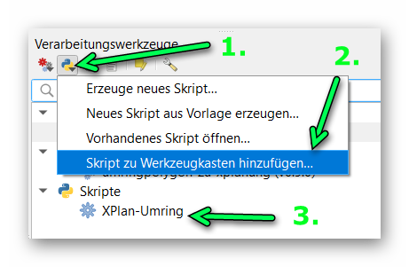

# umringpolygon-zu-xplanung
### _Umringpolygon eines Bebauungsplans aus QGIS nach XPlanung konvertieren_

Bei Fragen, Anmerkungen, etc. erreichen Sie uns auch per E-Mail unter [open@kreis-viersen.de](mailto:open@kreis-viersen.de?subject=umringpolygon-zu-xplanung).

## Es wird benötigt:
QGIS mit Skript [`xplan-umring.py`](https://kreis-viersen.github.io/umringpolygon-zu-xplanung/xplan-umring.py).

Das Skript kann dem QGIS-Werkzeugkasten hinzugefügt werden:

## Workflow

1. Bebauungsplanumring in QGIS digitalisieren oder vorhandenen Umring laden. Wichtig: Der Vektorlayer darf nur ein Objekt (= den Umring) vom Typ Polygon beinhalten.
2. QGIS-Skript `xplan-umring` ausführen. Eingabelayer ist der Vektorlayer mit dem Bebauungsplanumring, die übrigen Modelleingaben ensprechend befüllen/auswählen und Speicherort für das XPlan-Archiv festlegen.

## Anmerkungen

Bis auf das Feld _Plangeber_ sind alle Eingabefelder Pflicht. Hierbei handelt es sich nicht ausschließlich um Pflichtattribute gemäß der [XPlanung-Spezifikation]. Die Plflichtattribute ergeben sich auch durch die Verwendung der [XPlanBox] im [KRZN]-Gebiet. Die Attribute und Auswahlmöglichkeiten können sich zukunftig noch ändern, wir freuen uns über fachlichen Input :-)

Aktuell stehen drei Rechtsstände zur Auswahl, wodurch auch bestimmt wird, mit welchem Attribut das Datum angelegt wird:
- Aufstellungsbeschluss -> xplan:aufstellungsbeschlussDatum
- Satzung -> xplan:satzungsbeschlussDatum
- InkraftGetreten -> xplan:inkrafttretensDatum

Quelle (bearbeitet): https://xleitstelle.de/downloads/xplanung/releases/XPlanung%20Version%205.3/Objektartenkatalog%20%28PDF%29.pdf

## Klassisches Einsatz-Szenario

## XPlan-Reader
QGIS-Plugin zum Import einer XPlanGML-Datei: 
https://github.com/kreis-viersen/xplan-reader

[XPlanung-Spezifikation]: <https://xleitstelle.de/xplanung/releases-xplanung>
[KRZN]: <https://www.krzn.de/>
[XPlanBox]: <https://gitlab.opencode.de/diplanung/ozgxplanung>

