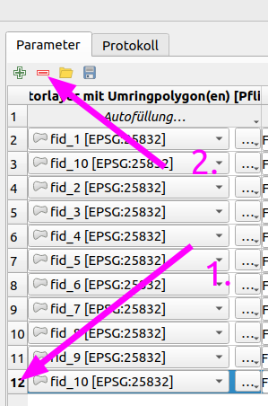

# xplan-umring
### _QGIS-Plugin zum Erstellen einer XPlanGML-Datei für ein Umringszenario (teilvektoriell)_

Bei Fragen, Anmerkungen, etc. erreichen Sie uns auch per E-Mail unter [open@kreis-viersen.de](mailto:open@kreis-viersen.de?subject=xplan-umring).

## Installation

Es wird **QGIS mindestens in der Version 3.24.0** benötigt.<br><br>
Das Plugin ist im offiziellen [QGIS-Plugin-Repository] enthalten und kann in QGIS über das Hauptmenü (*Erweiterungen -> Erweiterungen verwalten und installieren*) installiert und auch bei Verfügbarkeit einer neuen Version aktualisiert werden.

Nach der Installation des Plugins kann das gewünschte Werkzeug über einen Auswahldialog nach Klick auf das Toolbar-Icon ausgewählt werden:


Alternativ stehen die Werkzeuge unter **XPlan-Umring** über die QGIS-Werkzeugkiste zur Verfügung:


## Workflow neuen Plan erstellen

1. Umring(e) in QGIS digitalisieren oder vorhandene Umring(e) laden (z.B. mit dem QGIS-Plugin [Flurstücksfinder NRW]).<br>Wichtig: Der Eingabelayer muss ein Polygonlayer sein. 
2. Gewünschtes QGIS-Werkzeug unter `XPlan-Umring` ausführen.<br>Eingabelayer ist der Vektorlayer mit dem/den Umring(en), die übrigen Eingaben ensprechend befüllen/auswählen und Speicherort für das XPlan-Archiv festlegen.


## Anmerkungen

Einige Eingabefelder sind Pflicht. Hierbei handelt es sich **nicht** ausschließlich um Pflichtattribute gemäß der [XPlanung-Spezifikation]. Die Pflichtattribute ergeben sich auch durch die Verwendung der [XPlanBox] im [KRZN]-Gebiet. Die Attribute und Auswahlmöglichkeiten können sich zukunftig noch ändern, wir freuen uns über fachlichen Input :-)

Aktuell stehen für den Bebauungsplan vier Rechtsstände zur Auswahl, wodurch auch bestimmt wird, mit welchem Attribut das Datum angelegt wird:
- Aufstellungsbeschluss -> xplan:aufstellungsbeschlussDatum
- Entwurf / ImVerfahren -> xplan:aenderungenBisDatum
- Satzung -> xplan:satzungsbeschlussDatum
- InkraftGetreten -> xplan:inkrafttretensDatum


Quelle (bearbeitet): https://xleitstelle.de/downloads/xplanung/releases/XPlanung%20Version%205.3/Objektartenkatalog%20%28PDF%29.pdf


## Werkzeug "Geometrie Update"

Umringgeometrie (räumlichen Geltungsbereich) einer XPlanGML ersetzen (alle anderen Attribute bleiben erhalten).

Neuen Geltungsbereich in QGIS digitalisieren oder vorhandenen(e) Umring(e) laden.<br>
Wichtig: Der Eingabelayer muss ein Polygonlayer sein.

Eingabelayer für das Skript ist der Vektorlayer mit dem/den Umring(en).
Dazu noch die zu verändernde XPlanGML und den Speicherort und Namen für die erzeugte XPlanGML festlegen.

Es werden nur XPlanGML mit maximal einem *_Bereich unterstützt.


## Werkzeug "Rasterplan auf Polygon zuschneiden"

Eingabelayer für das Werkzeug sind:
1. Rasterlayer mit dem Plan, welcher zugeschnitten werden soll.
2. Vektorlayer mit dem Polygon, welches zum Zuschneiden verwendet werden soll.

Dazu den Speicherort und Name für den erzeugten Rasterplan festlegen.


## Werkzeug "Polygon von Rasterplan abziehen"

Eingabelayer für das Werkzeug sind:
1. Rasterlayer mit dem Plan, von welchem die Fläche des Polygons abgezogen werden soll.
2. Vektorlayer mit dem Polygon, welches zum Abziehen verwendet werden soll.

Dazu den Speicherort und Name für den erzeugten Rasterplan festlegen.


## Klassisches Einsatz-Szenario


## XPlan-Umring im Batch-Modus verwenden

1. [Vorbereitung der Daten](#VorbereitungderDaten)
	* 1.1. [Einzelne Datensätze erzeugen](#EinzelneDatenstzeerzeugen)
	* 1.2. [Einzelne Datensätze in QGIS laden](#EinzelneDatenstzeinQGISladen)
2. [XPlan-Umring im Batch-Modus verwenden](#XPlan-UmringimBatch-Modusverwenden)
	* 2.1. [In den Batch-Modus wechseln](#IndenBatch-Moduswechseln)
	* 2.2. [Dateien mit Umringen hinzufügen](#DateienmitUmringenhinzufgen)
	* 2.3. [Zeile mit Umring im Batch-Modus löschen](#ZeilemitUmringimBatch-Moduslschen)
	* 2.4. [Feld mit dem gleichen Wert für alle Datensätze befüllen](#FeldmitdemgleichenWertfralleDatenstzebefllen)
	* 2.5. [Feld mit Attributwert des jeweiligen Umringobjektes befüllen](#FeldmitAttributwertdesjeweiligenUmringobjektesbefllen)
	* 2.6. [Batch-Modus-Konfiguration speichern](#Batch-Modus-Konfigurationspeichern)
	* 2.7. [Batch-Prozess starten](#Batch-Prozessstarten)

###  1. <a name='VorbereitungderDaten'></a>Vorbereitung der Daten

####  1.1. <a name='EinzelneDatenstzeerzeugen'></a>Einzelne Datensätze erzeugen

Die Geltungsbereiche müssen jeweils in einem Vektorformat wie z.B. Shape-Datei oder GeoPackage mit Attributwerten vorliegen (pro Umring eine Datei).

Sollten die Umringe gesammelt in einer Datei vorliegen, kann mit dem QGIS-Standard-Werkzeug _Vektorlayer teilen_ eine Datei pro Umring erstellt werden.

Beispiel:


Ergebnis:


####  1.2. <a name='EinzelneDatenstzeinQGISladen'></a>Einzelne Datensätze in QGIS laden

Anschließend die einzelnen Datensätze in dem Ordner alle markieren und per drag'n'drop in QGIS öffnen:


###  2. <a name='XPlan-UmringimBatch-Modusverwenden'></a>XPlan-Umring im Batch-Modus verwenden

####  2.1. <a name='IndenBatch-Moduswechseln'></a>In den Batch-Modus wechseln

Zuerst das gewünschte Umring-Werkzeug auswählen, z.B. Flächennutzungsplan für XPlanung v6.0:


Anschließend über die Schaltfläche _Als Batchprozess starten..._ in den Batch-Modus wechseln:


####  2.2. <a name='DateienmitUmringenhinzufgen'></a>Dateien mit Umringen hinzufügen

Als erstes werden in der folgenden Eingabemaske die Dateien mit den Umringen hinzugefügt.

Hierzu beim Feld __Vektorlayer mit Umringpolygon(en) [Pflicht]__ zuerst auf _Autofüllung..._ und dann im sich öffnenden Menü auf _Aus geöffneten Layern wählen..._ klicken.


Anschließend alle Layer wählen und mit OK bestätigen:


Als Ergebnis wurde je Umringdatei eine eigene Zeile (= Datensatz) angelegt:


####  2.3. <a name='ZeilemitUmringimBatch-Moduslschen'></a>Zeile mit Umring im Batch-Modus löschen

Sollte ein Layer doppelt vorhanden sein (z.B. weil beim Aufruf des Batch-Modus schon automatisch ein Layer hinzugefügt wurde), kann dieser mit Klick auf die Spaltennummer ausgewählt (wird dann blau hinterlegt) und mit dem roten Minussymbol gelöscht werden:



####  2.4. <a name='FeldmitdemgleichenWertfralleDatenstzebefllen'></a>Feld mit dem gleichen Wert für alle Datensätze befüllen

Hierzu das gewünschte Feld des obersten Datensatz (Zeile 2) wie gewünscht befüllen.

Je nach Feldtyp ist dies ein:
- Verzeichnis
- freier Text (String)
- Datum
- Wert aus einem Dropdown-Menü


Anschließend auf _Autofüllung..._ klicken und anschließend _Nach unten füllen_.


Somit wird für alle Datensätze der gleiche Wert eingetragen:


Der Speicherpfad kann über die drei Punkte rechts neben dem Eingabefeld ausgewählt werden und dann ebenfalls mit _Nach unten füllen_ für die übrigen Datensätze übernommen werden..


####  2.5. <a name='FeldmitAttributwertdesjeweiligenUmringobjektesbefllen'></a>Feld mit Attributwert des jeweiligen Umringobjektes befüllen

Attributwerte der einzelnen Datensätze können grundsätzlich als Zeichenkette (String) für die Erzeugung einer XPlanGML-Datei übernommen werden.

Soll ein Datumsfeld befüllt werden, muss das Datum wie folgt als Zeichenkette (String) als Attributwert vorhanden sein:

```
JJJJ-MM-TT
```

z.B. für den 21.07.2024
```
2024-07-21
```

Felder, die in XPlan-Umring mit einem Dropdownmenü belegt werden, müssen als Attributwert genau die Zeichenkette (String) des gewünschten Eintrags enthalten. z.B.

```
3000 (Regionaler FPlan)
```

Um Felder individuell mit Attributwerten zu befüllen auf _Autofüllung..._ klicken und anschließend _Nach Ausdruck berechnen..._:


Mit folgendem Ausdruck lässt sich der gewünschte Attributwert für alle Datensätze automatisch hinzufügen (`Feldname` durch das gewünschte Feld ersetzen):

```
aggregate( @Umring ,'min', "Feldname" )
```

Hier ein Beispiel mit dem Feldnamen `synname`:


Jeder Datensatz erhält dadurch seinen individuellen Attributwert:


Soll das Koordinatenbezugssystem (KBS) nicht aus einem Attributwert befüllt werden, sondern das KBS des jeweiligen Vektorlayers verwendet werden, ist dies mit dem folgenden Ausdruck möglich:

```
layer_property( @Umring, 'crs')
```

Akzeptiert werden auch hier allerdings nur Werte, die auch im Dropdownmenü zur KBS-Auswahl verfügbar sind.


####  2.6. <a name='Batch-Modus-Konfigurationspeichern'></a>Batch-Modus-Konfiguration speichern

Über das Disketten-Symbol kann eine Batch-Konfiguration (die befüllten Felder) gesichert werden und zu einem späteren Zeipunkt über das Ordner-Symbol geladen werden.


####  2.7. <a name='Batch-Prozessstarten'></a>Batch-Prozess starten

Der Batch-Prozess und damit die Erzeugung der jeweiligen gezippten XPlanGML-Dateien wird über die Schaltfläche _Starte_ ausgeführt:


## Daten zum Amtlichen Gemeindeschlüssel (AGS)

Im Verzeichnis [ags] befindet sich eine Liste _Amtlichen Gemeindeschlüssel (AGS)_.

Quelle: https://www.xrepository.de/details/urn:de:bund:destatis:bevoelkerungsstatistik:schluessel:ags

© Daten (im Auftrag der Herausgebergemeinschaft Statistische Ämter des Bundes und der Länder)  
    Statistisches Bundesamt (Destatis)

## XPlan-Reader
QGIS-Plugin zum Import einer XPlanGML-Datei:<br>
https://github.com/kreis-viersen/xplan-reader

[QGIS-Plugin-Repository]: <https://plugins.qgis.org/plugins/xplan-umring/>
[Flurstücksfinder NRW]: <https://github.com/kreis-viersen/flurstuecksfinder-nrw>
[XPlanung-Spezifikation]: <https://xleitstelle.de/xplanung/releases-xplanung>
[KRZN]: <https://www.krzn.de/>
[XPlanBox]: <https://gitlab.opencode.de/diplanung/ozgxplanung>
[ags]: ./ags/

