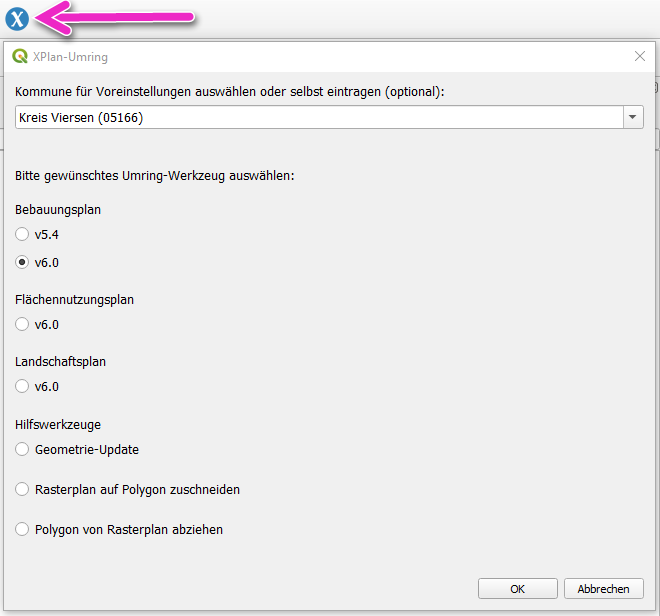
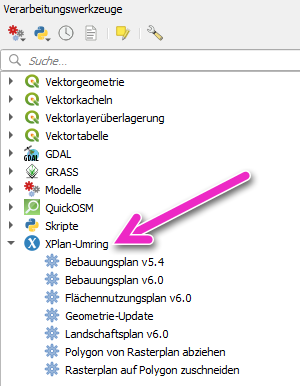

# xplan-umring
### _QGIS-Plugin zum Erstellen einer XPlanGML-Datei für ein Umringszenario (teilvektoriell)_

Bei Fragen, Anmerkungen, etc. erreichen Sie uns auch per E-Mail unter [open@kreis-viersen.de](mailto:open@kreis-viersen.de?subject=xplan-umring).

## Installation

Es wird **QGIS mindestens in der Version 3.24.0** benötigt.  
Das Plugin ist im offiziellen [QGIS-Plugin-Repository] enthalten und kann in QGIS über das Hauptmenü (*Erweiterungen -> Erweiterungen verwalten und installieren*) installiert und auch bei Verfügbarkeit einer neuen Version aktualisiert werden.

Nach der Installation des Plugins kann das gewünschte Werkzeug über einen Auswahldialog nach Klick auf das Toolbar-Icon ausgewählt werden:

Alternativ stehen die Werkzeuge unter **XPlan-Umring** über die QGIS-Werkzeugkiste zur Verfügung:

## Workflow neuen Plan erstellen

1. Umring(e) in QGIS digitalisieren oder vorhandene Umring(e) laden (z.B. mit dem QGIS-Plugin [Flurstücksfinder NRW]). Wichtig: Der Eingabelayer muss ein Polygonlayer sein. 
2. Gewünschtes QGIS-Werkzeug unter `XPlan-Umring` ausführen. Eingabelayer ist der Vektorlayer mit dem/den Umring(en), die übrigen Eingaben ensprechend befüllen/auswählen und Speicherort für das XPlan-Archiv festlegen.

## Anmerkungen

Einige Eingabefelder sind Pflicht. Hierbei handelt es sich **nicht** ausschließlich um Pflichtattribute gemäß der [XPlanung-Spezifikation]. Die Pflichtattribute ergeben sich auch durch die Verwendung der [XPlanBox] im [KRZN]-Gebiet. Die Attribute und Auswahlmöglichkeiten können sich zukunftig noch ändern, wir freuen uns über fachlichen Input :-)

Aktuell stehen für den Bebauungsplan vier Rechtsstände zur Auswahl, wodurch auch bestimmt wird, mit welchem Attribut das Datum angelegt wird:
- Aufstellungsbeschluss -> xplan:aufstellungsbeschlussDatum
- Entwurf / ImVerfahren -> xplan:aenderungenBisDatum
- Satzung -> xplan:satzungsbeschlussDatum
- InkraftGetreten -> xplan:inkrafttretensDatum

Quelle (bearbeitet): https://xleitstelle.de/downloads/xplanung/releases/XPlanung%20Version%205.3/Objektartenkatalog%20%28PDF%29.pdf

## Werkzeug Geltungsbereich ersetzen

Umringgeometrie (räumlichen Geltungsbereich) einer XPlanGML ersetzen (alle anderen Attribute bleiben erhalten).

Neuen Geltungsbereich in QGIS digitalisieren oder vorhandenen(e) Umring(e) laden. 
Wichtig: Der Eingabelayer muss ein Polygonlayer sein.

Eingabelayer für das Skript ist der Vektorlayer mit dem/den Umring(en).
Dazu noch die zu verändernde XPlanGML und den Speicherort und Namen für die erzeugte XPlanGML festlegen.

Es werden nur XPlanGML mit maximal einem *_Bereich unterstützt.

## Klassisches Einsatz-Szenario

## Daten zum Amtlichen Gemeindeschlüssel (AGS)

Im Verzeichnis [ags] befindet sich eine Liste _Amtlichen Gemeindeschlüssel (AGS)_.

Quelle: https://www.xrepository.de/details/urn:de:bund:destatis:bevoelkerungsstatistik:schluessel:ags

© Daten (im Auftrag der Herausgebergemeinschaft Statistische Ämter des Bundes und der Länder)  
    Statistisches Bundesamt (Destatis)

## XPlan-Reader
QGIS-Plugin zum Import einer XPlanGML-Datei: 
https://github.com/kreis-viersen/xplan-reader

[QGIS-Plugin-Repository]: <https://plugins.qgis.org/plugins/xplan-umring/>
[Flurstücksfinder NRW]: <https://github.com/kreis-viersen/flurstuecksfinder-nrw>
[XPlanung-Spezifikation]: <https://xleitstelle.de/xplanung/releases-xplanung>
[KRZN]: <https://www.krzn.de/>
[XPlanBox]: <https://gitlab.opencode.de/diplanung/ozgxplanung>
[ags]: ./ags/

